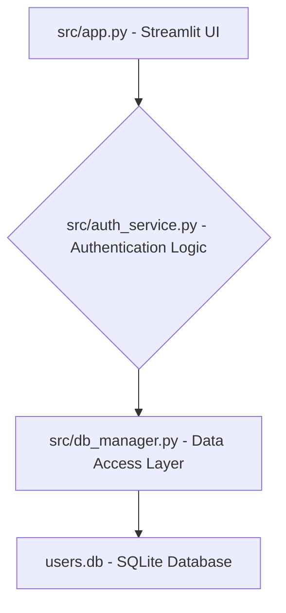

As a Principal Software Architect, I've reviewed your existing Streamlit application. The current in-memory user authentication is simple and effective for demonstration, but it lacks persistence, security, and scalability required for a real-world application.

Since the "New Business Requirement Specification (BRS)" was not provided, I will proceed with a common and logical next step for such an application: **"Enhance the user authentication system to be persistent, more secure, and support user roles."** This BRS will guide the following Solution Design Specification.

---

# Solution Design Specification (SDS)

## Project: Streamlit User Authentication Enhancement
**Version:** 1.0
**Date:** 2023-10-27
**Author:** Principal Software Architect

---

## 1. Introduction

This Solution Design Specification outlines the architectural changes, database modifications, and implementation steps required to enhance the existing Streamlit application's user authentication. The primary goals are to introduce data persistence, improve security by hashing passwords, and lay the groundwork for user role management.

**Assumed Business Requirement (BRS):** "Enhance the user authentication system to be persistent, more secure, and support user roles."

## 2. System Architecture Changes

The current architecture is monolithic, with authentication logic and data storage (in-memory dictionary) tightly coupled within `app.py`. The proposed architecture introduces modularity by separating concerns into distinct Python modules:

*   **`app.py` (UI Layer):** Will primarily manage Streamlit UI components and orchestrate calls to the `auth_service`. It will no longer directly manage user data or authentication logic.
*   **`auth_service.py` (Authentication Logic Layer):** This new module will encapsulate all business logic related to user authentication and registration. It will interact with the `db_manager` for data persistence and handle password hashing/verification.
*   **`db_manager.py` (Data Access Layer - DAL):** This new module will abstract all interactions with the database. It will provide functions for creating tables, adding users, retrieving users, etc., shielding the `auth_service` from database-specific details.
*   **`users.db` (Database):** A SQLite database file will be introduced for persistent storage of user data. SQLite is chosen for its simplicity and file-based nature, making it easy to integrate with Streamlit without requiring a separate database server.

**High-Level Architecture Diagram:**



**Key Architectural Principles Applied:**

*   **Separation of Concerns:** Each module has a single, well-defined responsibility.
*   **Data Persistence:** Moving from in-memory to a file-based database.
*   **Security:** Introduction of password hashing.
*   **Modularity:** Easier to test, maintain, and extend individual components.

## 3. Detailed API Specifications (Internal)

These "APIs" refer to the interfaces provided by the new Python modules.

### `db_manager.py` (Data Access Layer)

This module will handle all direct interactions with the `users.db` SQLite database.

**Functions:**

*   `init_db()`
    *   **Description:** Initializes the database by creating the `users` table if it doesn't already exist. Can also populate an initial admin user if the table is empty.
    *   **Parameters:** None
    *   **Returns:** `None`
    *   **Raises:** `sqlite3.Error` on database operation failure.

*   `add_user(username: str, email: str, password_hash: str, role: str = 'user')`
    *   **Description:** Inserts a new user record into the `users` table.
    *   **Parameters:**
        *   `username` (str): Unique username.
        *   `email` (str): Unique email address.
        *   `password_hash` (str): Hashed password.
        *   `role` (str, optional): User's role (e.g., 'user', 'admin'). Defaults to 'user'.
    *   **Returns:** `bool` - `True` if user added successfully, `False` otherwise (e.g., username/email already exists).
    *   **Raises:** `sqlite3.Error` on database operation failure.

*   `get_user_by_username(username: str)`
    *   **Description:** Retrieves a user's details from the database based on their username.
    *   **Parameters:**
        *   `username` (str): The username to look up.
    *   **Returns:** `dict` - A dictionary containing user data (`id`, `username`, `email`, `password_hash`, `role`, `created_at`), or `None` if not found.
    *   **Raises:** `sqlite3.Error` on database operation failure.

### `auth_service.py` (Authentication Logic Layer)

This module will manage the core authentication and registration business logic, utilizing `db_manager` for data persistence and `bcrypt` for password security.

**Dependencies:** `db_manager.py`, `bcrypt` (or `passlib`)

**Functions:**

*   `hash_password(password: str)`
    *   **Description:** Hashes a plain-text password using a secure hashing algorithm (e.g., bcrypt).
    *   **Parameters:**
        *   `password` (str): The plain-text password.
    *   **Returns:** `bytes` - The hashed password suitable for storage.

*   `verify_password(plain_password: str, hashed_password: bytes)`
    *   **Description:** Verifies if a plain-text password matches a given hashed password.
    *   **Parameters:**
        *   `plain_password` (str): The plain-text password provided by the user.
        *   `hashed_password` (bytes): The stored hashed password.
    *   **Returns:** `bool` - `True` if passwords match, `False` otherwise.

*   `register_user(username: str, email: str, password: str, role: str = 'user')`
    *   **Description:** Registers a new user. It hashes the password and calls `db_manager.add_user`.
    *   **Parameters:**
        *   `username` (str): New user's username.
        *   `email` (str): New user's email.
        *   `password` (str): New user's plain-text password.
        *   `role` (str, optional): User's role. Defaults to 'user'.
    *   **Returns:** `tuple` - `(bool, str)` where `bool` indicates success and `str` is a message.

*   `authenticate_user(username: str, password: str)`
    *   **Description:** Authenticates a user by checking credentials against the database.
    *   **Parameters:**
        *   `username` (str): Username provided by the user.
        *   `password` (str): Plain-text password provided by the user.
    *   **Returns:** `dict` - User dictionary (without `password_hash`) if authentication is successful, `None` otherwise.

## 4. Database Schema Changes

The current in-memory `user_db` dictionary will be replaced by a `users` table in `users.db`.

**Table Name:** `users`

| Column Name     | Data Type          | Constraints                            | Description                                   |
| :-------------- | :----------------- | :------------------------------------- | :-------------------------------------------- |
| `id`            | INTEGER            | PRIMARY KEY AUTOINCREMENT              | Unique identifier for the user.               |
| `username`      | TEXT               | NOT NULL, UNIQUE                       | User's chosen username.                       |
| `email`         | TEXT               | NOT NULL, UNIQUE                       | User's email address.                         |
| `password_hash` | TEXT               | NOT NULL                               | Securely hashed password (e.g., bcrypt hash). |
| `role`          | TEXT               | NOT NULL, DEFAULT 'user'               | User's assigned role (e.g., 'user', 'admin'). |
| `created_at`    | TIMESTAMP          | DEFAULT CURRENT_TIMESTAMP              | Timestamp when the user account was created.  |

**Example Data in `users.db`:**

| id | username | email              | password_hash                                  | role  | created_at                  |
| -- | -------- | ------------------ | ---------------------------------------------- | ----- | --------------------------- |
| 1  | admin    | admin@example.com  | `$2b$12$HASHED_PASSWORD_STRING_HERE...`        | admin | 2023-10-27 10:00:00         |
| 2  | alice    | alice@example.com  | `$2b$12$ANOTHER_HASHED_PASSWORD_STRING...`     | user  | 2023-10-27 10:05:30         |

## 5. Step-by-Step Implementation Plan

This plan is for a developer to follow to implement the SDS.

### Phase 1: Setup and Data Access Layer (`db_manager.py`)

1.  **Install Dependencies:**
    *   `pip install streamlit bcrypt` (or `passlib` if preferred, but `bcrypt` is simpler for this scope).

2.  **Create `src/db_manager.py`:**
    *   Create a new file `src/db_manager.py`.
    *   **Implement `get_db_connection()` function:** A helper function to connect to `users.db`. Use `sqlite3.Row` factory for dictionary-like access to rows.
        ```python
        import sqlite3

        DATABASE_NAME = "users.db"

        def get_db_connection():
            conn = sqlite3.connect(DATABASE_NAME)
            conn.row_factory = sqlite3.Row # Allows accessing columns by name
            return conn
        ```
    *   **Implement `init_db()` function:**
        *   It should create the `users` table as defined in Section 4.
        *   Add logic to create a default 'admin' user if the table is empty. This prevents the app from being unusable on the first run.
        ```python
        def init_db():
            conn = get_db_connection()
            cursor = conn.cursor()
            cursor.execute("""
                CREATE TABLE IF NOT EXISTS users (
                    id INTEGER PRIMARY KEY AUTOINCREMENT,
                    username TEXT NOT NULL UNIQUE,
                    email TEXT NOT NULL UNIQUE,
                    password_hash TEXT NOT NULL,
                    role TEXT NOT NULL DEFAULT 'user',
                    created_at TIMESTAMP DEFAULT CURRENT_TIMESTAMP
                );
            """)
            
            # Optional: Add a default admin user if no users exist
            cursor.execute("SELECT COUNT(*) FROM users")
            if cursor.fetchone()[0] == 0:
                print("No users found, adding default admin user...")
                from auth_service import hash_password # Temporarily import here for initial setup
                admin_password_hash = hash_password("password123").decode('utf-8')
                cursor.execute("""
                    INSERT INTO users (username, email, password_hash, role)
                    VALUES (?, ?, ?, ?)
                """, ("admin", "admin@example.com", admin_password_hash, "admin"))
                print("Default admin user created: username='admin', password='password123'")

            conn.commit()
            conn.close()
        ```
        *   *Self-correction:* The `hash_password` import within `init_db` is a circular dependency if `auth_service` imports `db_manager`. For initial setup, it's acceptable, but `init_db` itself shouldn't ideally create users with hashed passwords without calling `auth_service`. A better pattern might be a separate `setup_initial_admin.py` script or just making `init_db` purely schema-focused and requiring the first user to be registered through the signup form. For simplicity and getting started, the current approach is okay, but note the dependency.
    *   **Implement `add_user()` function:** Handles inserting user data, including the `password_hash` and `role`. Include error handling for unique constraints.
    *   **Implement `get_user_by_username()` function:** Retrieves user details by username.

### Phase 2: Authentication Logic Layer (`auth_service.py`)

1.  **Create `src/auth_service.py`:**
    *   Import `bcrypt` and `db_manager`.
    *   **Implement `hash_password()` function:** Use `bcrypt.hashpw` and `bcrypt.gensalt`.
    *   **Implement `verify_password()` function:** Use `bcrypt.checkpw`.
    *   **Implement `register_user()` function:**
        *   Validate inputs (e.g., username/password not empty).
        *   Hash the plain-text password using `hash_password()`.
        *   Call `db_manager.add_user()` with the hashed password and provided role.
        *   Return appropriate success/failure messages.
    *   **Implement `authenticate_user()` function:**
        *   Call `db_manager.get_user_by_username()` to fetch user data.
        *   If user exists, call `verify_password()` to compare the provided password with the stored hash.
        *   Return the user's data (excluding `password_hash`) if authenticated, else `None`.

### Phase 3: Refactor `src/app.py` (UI Layer)

1.  **Remove Old In-Memory DB:**
    *   Delete the `if 'user_db' not in st.session_state:` block and all direct references to `st.session_state['user_db']`.

2.  **Import New Modules:**
    *   Add `from db_manager import init_db` at the top.
    *   Add `from auth_service import register_user, authenticate_user` at the top.

3.  **Initialize Database on App Startup:**
    *   Call `init_db()` once when the app starts. A good place might be just after initial session state setup or within a `st.experimental_singleton` if you want to ensure it runs only once *ever* for the app process, not on every rerun. For simplicity, just calling it once at the top of the script is okay for now.
        ```python
        # Ensure DB is initialized
        init_db()
        ```

4.  **Update `login_user()` function:**
    *   Modify `login_user(username, password)` to call `auth_service.authenticate_user()`.
    *   If authentication is successful, store the authenticated `user_data` (e.g., `username`, `email`, `role`) in `st.session_state` and set `logged_in` to `True`.
    *   Update the success message.
    *   ```python
        def login_user(username, password):
            user_data = authenticate_user(username, password)
            if user_data:
                st.session_state['logged_in'] = True
                st.session_state['current_user'] = user_data['username']
                st.session_state['current_user_email'] = user_data['email'] # Store email
                st.session_state['current_user_role'] = user_data['role'] # Store role
                st.success(f"Logged in successfully as {user_data['username']} ({user_data['role']})!")
                st.rerun()
            else:
                st.error("Incorrect username or password")
        ```

5.  **Update `signup_user()` function:**
    *   Modify `signup_user(username, email, password)` to call `auth_service.register_user()`.
    *   Handle the success/failure tuple returned by `register_user`.
    *   ```python
        def signup_user(username, email, password):
            success, message = register_user(username, email, password) # No role input yet
            if success:
                st.success(message)
            else:
                st.warning(message)
        ```
    *   *Optional:* Add a `st.selectbox` for `role` in the signup form if you want to allow users to sign up with different initial roles (e.g., 'user', 'guest'). For now, `auth_service` defaults to 'user'.

6.  **Update Logged-in Content:**
    *   Modify the main application area to display information (like email and role) from `st.session_state['current_user_email']` and `st.session_state['current_user_role']` instead of querying the (now removed) in-memory `user_db`.
    *   ```python
        else: # If logged in
            st.sidebar.header(f"Welcome, {st.session_state['current_user']}!")
            st.sidebar.info(f"Role: {st.session_state.get('current_user_role', 'N/A')}")
            if st.sidebar.button("Logout"):
                logout_user()

            st.markdown("## Main Application Area")
            st.write(f"You are securely logged in as **{st.session_state['current_user']}**.")
            st.write(f"Your email is: **{st.session_state.get('current_user_email', 'Not available')}**")
            st.write(f"Your role is: **{st.session_state.get('current_user_role', 'Not available')}**")
            st.balloons()
        ```

### Phase 4: Testing

1.  **Initial Run:** Start the Streamlit app. Check your project directory for `users.db`. Verify that the default 'admin' user (`admin`/`password123`) can log in.
2.  **Signup:** Try to sign up a new user. Verify their details (including hashed password and default 'user' role) are in `users.db` using a SQLite browser tool (e.g., DB Browser for SQLite).
3.  **Login/Logout:** Test login and logout for new and existing users.
4.  **Error Handling:** Test with incorrect credentials, existing usernames during signup, and empty fields.
5.  **Persistence:** Restart the Streamlit app after logging in a user. The user should be logged out (as `st.session_state` resets), but their account should still exist in `users.db`. Log in again to confirm persistence.

### Phase 5: Cleanup and Refinement

1.  Remove any temporary print statements or debug code.
2.  Add docstrings and type hints to all new functions for better readability and maintainability.
3.  Consider adding a `requirements.txt` file (`pip freeze > requirements.txt`).
4.  Review error messages for clarity to the end-user.

This SDS provides a comprehensive plan to transition your Streamlit app from a simple in-memory authentication to a more robust, persistent, and secure system with foundational support for user roles.